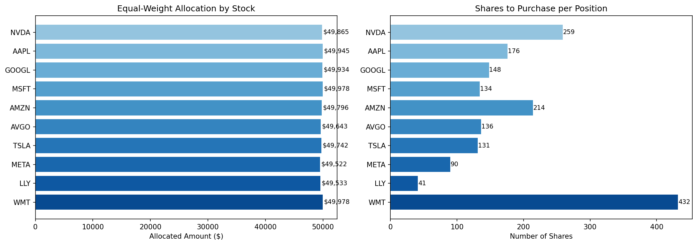

# Equal-Weight S&P 500 Investing Algorithm

An equal-weight portfolio optimisation algorithm that constructs diversified equity portfolios from the S&P 500 using real-time market data, with automated position sizing based on portfolio value.

## Overview

This algorithm takes a universe of S&P 500 securities, selects the top 10 by market capitalisation, and constructs an equal-weight portfolio. Each position receives the same dollar allocation regardless of market cap, providing balanced exposure across all holdings — unlike cap-weighted indices where a few mega-caps dominate.

## Tools & Libraries

- **Python** (pandas, NumPy, yfinance, matplotlib)
- Real-time market data via Yahoo Finance API
- Automated position sizing and rebalancing calculations

## Key Features

- Fetches live market data for 50 S&P 500 stocks across 9 sectors
- Selects top 10 stocks by market capitalisation
- Calculates equal-weight allocations for a $500,000 portfolio
- Outputs recommended share quantities per position
- Visualises allocation and share distribution

## Sample Output

## Project Type

Personal Project

## Usage

Open [`equal_weight_investing.ipynb`](equal_weight_investing.ipynb) for the full implementation and walkthrough.
